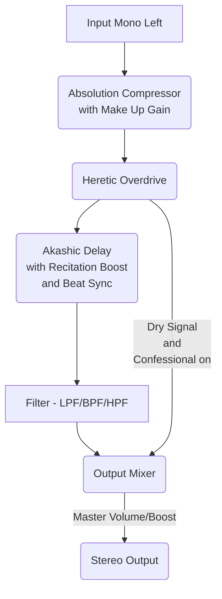

```mermaid
flowchart TD
    A[Input Mono Left] --> Abs(Absolution Compressor\nwith Make Up Gain)
    Abs --> O(Heretic Overdrive)
    O --> D(Akashic Delay\nwith Recitation Boost\nand Beat Sync)
    D --> F[Filter - LPF/BPF/HPF]
    F --> AO
    O --> |Dry Signal\nand\nConfessional on| AO(Output Mixer)
    AO --> |Master Volume/Boost| AOO(Stereo Output)
```
